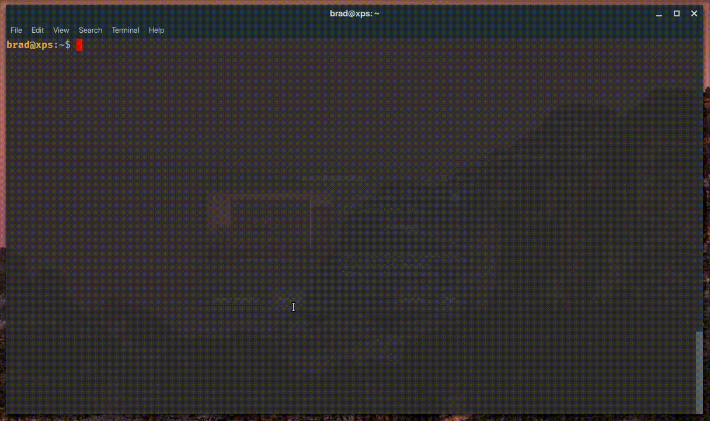

# Pray App

Install with:


[](https://snapcraft.io/pray)

or:

```
sudo snap install pray --edge
```



Pray is a simple command line program to help you pray following the ancient practice of lectio divina. This timed session takes about 12 minutes and consists of 4 parts:

- (1) Lectio: read,
- (2) Meditatio: meditate,
- (3) Oratio: prayer and
- (4) Contemplatio: sit in silence.

